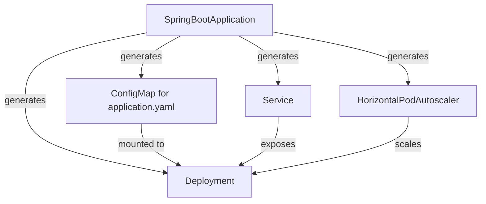

# Spring Boot Operator

The Spring Boot Operator allows your application developers to focus on what's important for deploying spring boot (web) applications to Kubernetes. 

By creating a simple API, the spring boot operator cuts all the unnecessary boilerplate down to a single simple solution. Incoorporating best practices when it comes to security out the box.

## Why use this operator?

If you want to deploy a spring boot application, you have to first build a complex deployment spec, expose it with a service, create a configmap for the spring boot configuration and that's before they've worried about scaling or security best practice. The spring boot operator simplifies this process - simplifying the process of deploying spring boot applications down to a single, simple yaml document.

## How does it work?

The operator works by provisioning the resources you need to run a spring boot application with none of the extra fluff.

## Samples

To view some example CRDs, have a look [here](https://github.com/Dante-lor/spring-boot-operator/tree/main/config/samples).